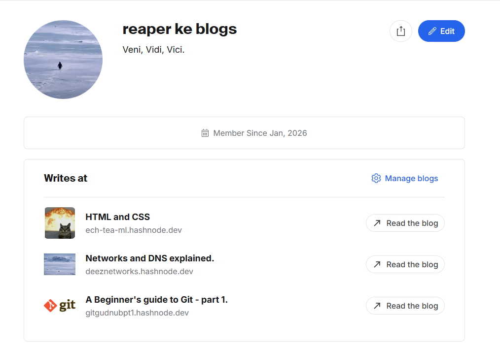

# Blogs
A link to all the blogs i have published on HashNode

You can follow me on hashnode - https://hashnode.com/@reaperggs

## Git and Github Blogs
https://gitgudnubpt1.hashnode.dev/

1. Git for Beginners: Basics and Essential Commands : https://gitgudnubpt1.hashnode.dev/basics-and-essentials-of-git
2. Inside Git: How It Works and the Role of the .git Folder : https://gitgudnubpt1.hashnode.dev/inside-git-how-it-works-and-the-role-of-the-git-folder
3. Why Version Control Exists: The Pendrive Problem : https://gitgudnubpt1.hashnode.dev/why-version-control-exists-the-pendrive-problem

## Networking Blogs
https://deeznetworks.hashnode.dev/

1. How DNS Resolution Works : https://deeznetworks.hashnode.dev/dns-and-dns-resolution
2. Understanding Network Devices : https://deeznetworks.hashnode.dev/understanding-network-devices
3. TCP Working: 3-Way Handshake & Reliable Communication : https://deeznetworks.hashnode.dev/hello-did-you-get-that-did-you-get-that-now
4. TCP vs UDP: When to Use What, and How TCP Relates to HTTP : https://deeznetworks.hashnode.dev/tcp-vs-udp
5. Getting Started with cURL : https://deeznetworks.hashnode.dev/curl-explained
6. DNS Record Types Explained : https://deeznetworks.hashnode.dev/dns-record-types-explained

## HTML/CSS Blogs
https://ech-tea-ml.hashnode.dev/

1. Understanding HTML Tags and Elements : https://ech-tea-ml.hashnode.dev/html-tags-and-elements
2. Emmet for HTML: A Beginner’s Guide to Writing Faster Markup : https://ech-tea-ml.hashnode.dev/emmet-declassified
3. CSS Selectors 101: Targeting Elements with Precision : https://ech-tea-ml.hashnode.dev/css-selectors
4. How a Browser Works: A Beginner-Friendly Guide to Browser Internals : https://ech-tea-ml.hashnode.dev/browsers
